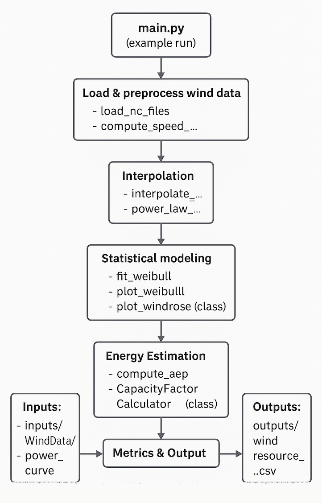

**Team**: BladePYrunners 

A Python package for assessing wind energy potential at a given location using meteorological data. It includes tools for processing wind data, interpolating it spatially, analyzing it statistically (via Weibull distribution), and calculating key wind turbine performance metrics like **Annual Energy Production (AEP)** and **Capacity Factor**.

This project helps estimate the energy output of wind turbines using environmental data. The analysis includes:

- Loading NetCDF wind data
- Computing wind speed and direction
- Interpolating wind conditions at specific coordinates
- Fitting Weibull distributions
- Plotting wind roses and distributions
- Calculating AEP and capacity factor
- Exporting results to a CSV file

## Project Structure

```bash
bladepyrunners/
├── inputs/                  # Input data files
│   ├── power_curve/         # Power curve CSV for NREL 5MW turbine
│   └── WindData/            # Wind data in NetCDF format
├── outputs/                 # Output results (e.g., CSV files)
├── src/                     # Source code
│   ├── __init__.py          # Main wind processing functions
│   └── Capacity_Factor_Class.py  # Class to compute capacity factor
├── tests/                   # Unit tests using pytest
│   ├── test_funcs.py
│   └── test_Capacity_Factor_Calculator.py
├── examples/
│   └── main.py              # Full pipeline example script
├── .gitignore
├── LICENSE
├── README.md
└── pyproject.toml
```
## Architecture Diagram


## Quick-start guide

To install and run the package locally: 

```bash
git clone https://github.com/DTUWindEducation/final-project-bladepyrunner.git
cd bladepyrunner
``` 
Create and activate a virtual environment (recommended):

```bash
python -m venv venv
source venv/bin/activate  # On Windows use: venv\Scripts\activate
```

Install dependencies:
```bash
pip install numpy pandas matplotlib xarray netCDF4 scipy windrose
```

## Classes and Key Files
### `Main.py` (in `examples/`)
Run the complete pipeline with:

```bash
python examples/main.py
```
This script will:

- Load wind data and compute wind speed & direction
- Interpolate wind to a specific location
- Calculate wind at 80m height
- Fit Weibull distribution and plot it
- Plot wind rose
- Compute AEP using the power curve
- Compute Capacity Factor

### Functions in `__init__.py` (in `src/`) 

Core functions used across the analysis pipeline:

- `load_nc_files()` – Load NetCDF climate data  
- `compute_speed_direction()` – Calculate wind speed and direction from U/V components  
- `interpolate_wind_data()` – Interpolate wind speeds at a given hub height 
- `power_law_calculation()` - Calculate wind speed at height z using the power law profile.
- `fit_weibull()` / `plot_weibull()` – Fit and visualize a Weibull distribution from wind data 
- `plot_windrose()` – Generate wind rose visualizations of wind patterns 
- `compute_aep()` / `compute_capacity_factor()` – Estimate energy production and efficiency  
- `compute_mean_wind_speed()` - Compute the mean wind speed at a specific location and height.

### Core Class: `CapacityFactorCalculator`
Location: `src/Capacity_Factor_Class.py`

This class computes the Capacity Factor from the AEP and rated power:
```bash
from src.Capacity_Factor_Class import CapacityFactorCalculator

cf_calc = CapacityFactorCalculator(rated_power_mw=5)
cf = cf_calc.compute(aep_gwh=17.32)
```
Attributes:
- rated_power_mw: float — Rated turbine power in MW

Method:
`compute(aep_gwh)`: Returns capacity factor as `cf = aep_gwh / (rated_power_mw × 8760)`

### Testing
Tests are implemented with pytest under the `/tests/` folder:

- `test_funcs.py`: Unit tests for `__init__.py` functions
- `test_Capacity_Factor_Calculator.py`: Tests for the capacity factor class

## Team contributions

- Max Rosendahl
- Rodrigo Sanchez Moreno
- Cristina Fente Gutierrez

